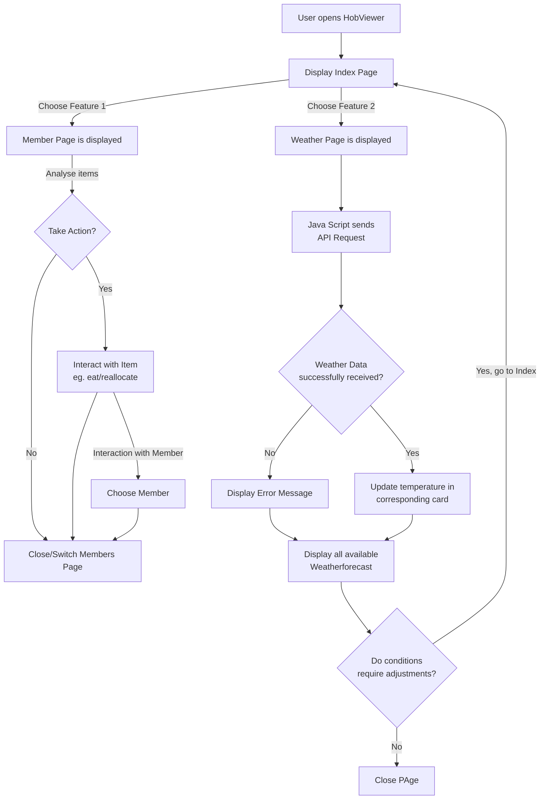

# Design Choices

## Table of Contents

- [System Capability](#system-capability)
- [Flowchart](#flowchart)
- [Wireframe](#wireframe)
- [Design Rationale](#design-rationale)

---

## System Capability

Our new extension of the HobViewer, The Weather Condition Check *(WCC)*, provides the Fellowship with substantial information about our surroundings. We do not only need to prove our respective data and resources, but also have a clear overview of external information available. To do so, we implemented the WCC, an extension to access and exchange real-time data of our surroundings. The Palantir, a mighty artefact of the enemy, served us inspiration, as it functions just like our javascript sending out an API Call and deliver real-time information between Sauron and Saruman.

---

## Flowchart

Our Flowchart describes user interaction, combined with insight to our script sending out an API Call to receive real-time-data
Now, from an user's perspective, when entering the HobViewer you can choose between accessing the inventory or weather page.
When entering the weather page, the user will be greeted by real-time data to main destinations on their way *There and Back Again*. If certain weather conditions require the user to make adjustments, they can easily switch back to the index page and access their own and other's inventory to make amends.

---

## Wireframe

The wireframe illustrates the new button on our index page to the left. On the right side, our wireframe for our WCC is displayed. Once entering the page, the user is welcomed by our interface. Interface displays 4 main areas of Middle Earth, providing main and side informations. Main information consists of real-time data about the weather in °C. Down below, we share general info about the area. At the bottom, the button serves as means to return to the index page for further interaction.

---

## Design Rationale

The WCC revolves around the HobViewer's main function - the inventory feature, to provide further information to the Fellowship. Knowledge is power, hence providing external data of our surroundings as means to assist our system capabilites defined at the beginning of our journey:
- Monitor and assess available resources to avoid shortages and support planning.
- Recognize changes and risks early
- Make informed decisions under uncertainty, based on a clear and shared overview of the situation

---
